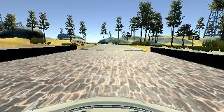
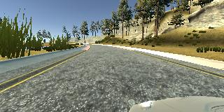
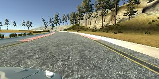
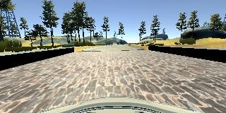
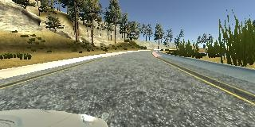
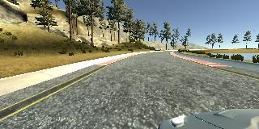

## Behavioral-Cloning Project

### 1. Overview
Steps followed in completion of the project are as follows:

* Drove car in simulator to collect data and saved the data in folder 'VarunData'.
* Added noise to center image and flipped left, center and right images to increase dataset.
* Defined the Convolutional Neural Network using keras.
* After achieving good accuracy on dataset, saved the model as 'model.h5'
* Used 'drive.py'to test the trained model and saved the data.
* Used 'video.py' to create the video from saved data in previous step. I have attached 2 videos. One is the video (video.mp4) created by 'video.py'. The quality of the video was not good, so I recoreded the video using screen recorder and saved it as 'video2.mp4'
### 2. Project Files

| Filename  |     Description	        					| 
|:---------:|:---------------------------------------------:| 
| model.py  | File to preprocess training data and define & train the model| 
| model.h5  | The model saved by model.py 	                   |
| drive.py  | Python file to test the model created by model.py|
| video.py	| Python file to generate video from test images   |
| video.mp4	| Output of video.py      				           |
| video2.mp4| Video recoreded by screen recorder               |
| VarunData | Folder contraining training data        	       |
### 2. Data Collection and Preprocessing of Image Data

I drove the car in Training mode for 3 laps. In first 2 laps, I drove car such that the car stays in the center and for 3rd lap, I drove the car to the extreme corners and steered it to the center every now and then. 

The images created after exiting training mode were center, left and right camera images as shown below:

  

To increase the size of dataset, I flipped center, left and right images as shown below:

  

To improve dataset further, I added noise to the center image as shown below:

### Design and Test a Model Architecture

#### 2. Describe what your final model architecture looks like including model type, layers, layer sizes, connectivity, etc.) Consider including a diagram and/or table describing the final model.

I used model based on Nvidia's paper with dropout of 0.8 just after cropping input and dropout of 0.6 after CNN. My final model consisted of the following layers:

| Layer         		|     Description	        					| 
|:---------------------:|:---------------------------------------------:| 
| Input         		| 160x320x3 RGB image   						|
| Cropping              | (70,25), (0,0) RGB image   					|
| Dropout        		| keep_prob=0.8        							|
| Convolution 5x5     	| 2x2 stride, valid padding 	                |
| RELU					|												|
| Convolution 5x5     	| 2x2 stride, valid padding 	                |
| RELU					|												|
| Convolution 5x5     	| 2x2 stride, valid padding 	                |
| RELU					|												|
| Convolution 5x5     	| valid padding 	                            |
| RELU					|												|
| Convolution 5x5     	| valid padding 	                            |
| RELU					|												|
| Dropout        		| keep_prob=0.6        							|
| Flatten		        |        									    |
| Dense         		|         									    |
| Dense         		|                							    |
| Dense         	    |												|
| Dense  				|												|
#### 3. Describe how you trained your model. The discussion can include the type of optimizer, the batch size, number of epochs and any hyperparameters such as learning rate.

To train the model, I used following parameters:
    * learning rate=0.0001
    * loss function =mse (mean square error)
    * Probability of keeping a node while using droput = 0.7
    * Number of Epochs = 5
    * Optimizer = Adam
